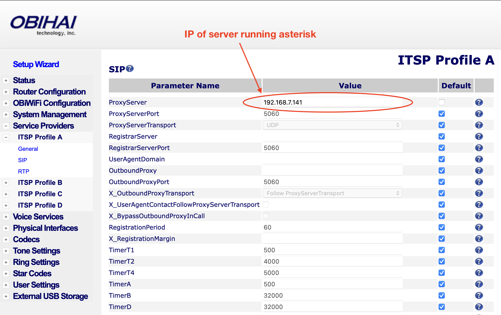
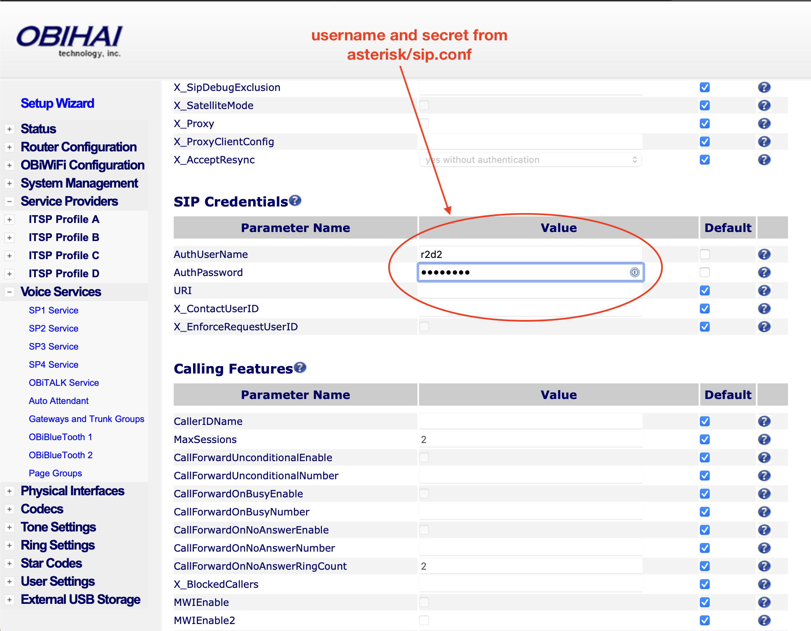

# R2D2

Ring my R2D2 phone.


### Usage

Here's how I have this running currently, future Luke:

```sh
# sync files to server
npm run sync # or download and unpack tarball on server
ssh server
cd /path/to/docker/r2d2
echo -e "ADMIN_USER=username\nADMIN_SECRET=adminpassword" > .env
./build.sh
./run.sh # ./run.sh --interactive locally to debug stuff
```

### CLI

```sh
npx @lukekarrys/r2d2 -h HOST -u USERNAME -p PASSWORD
```

### Obihai Setup

**Server**


**SIP**


### FAQ

#### What does this have to do with R2D2?

Oh, nothing really. Except everything.

#### You've been looking at asterisk conf files and documentation for too long, haven't you?

Maybe. But that's not the point.

#### Then what is the point? Really I'm _dying_ to know.

I can run `npm link` and then run `R2D2` and my [R2D2 telephone](http://www.amazon.com/Telemania-Star-Wars-Novelty-Phone/dp/B00001U0IG) will ring.

#### Whaaaaaaa?!! You weren't kidding! This is a game changer! I want my own!

**I KNOW RIGHT!?** I need to write up a blog post about this. If there is no link here yet, please bug me about it. [_Update: [did it.](http://lukecod.es/2014/03/28/beep-boop-ringing-an-r2d2-telephone-with-obihai-asterisk-and-node/)_] I'm [@lukekarrys](https://twitter.com/lukekarrys) on Twitter.

#### I was still being sarcastic. Really, does this have any purpose?

Nope, just the old hack 'n' learn. Maybe I'll hook it up to something cool? Like a tweet listener? So people can scare the crap out of me with my incredibly loud R2D2 phone in my office?
